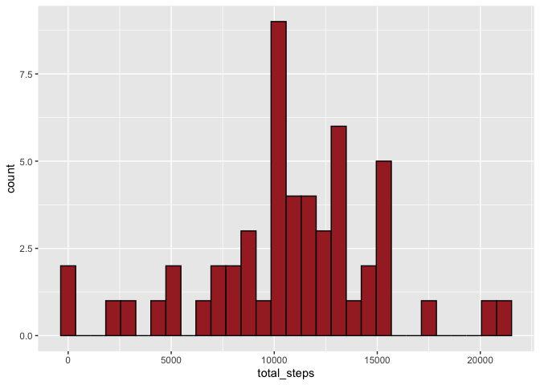
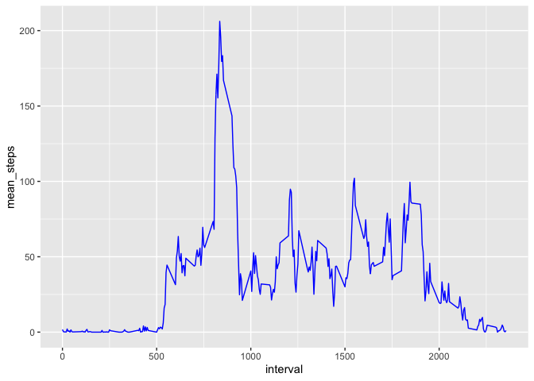
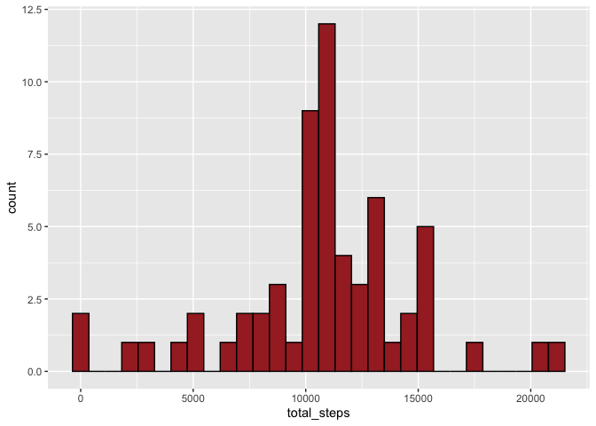
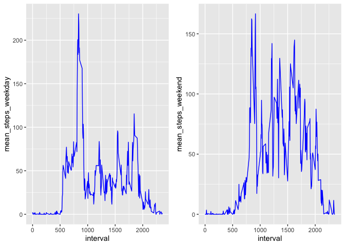

# Assignment

## Loading and preprocessing the data

Loading packages

```r
library(dplyr)
```

```
## 
## Attaching package: 'dplyr'
```

```
## The following objects are masked from 'package:stats':
## 
##     filter, lag
```

```
## The following objects are masked from 'package:base':
## 
##     intersect, setdiff, setequal, union
```

```r
library(ggplot2)
library(tidyverse)
```

```
## ── Attaching packages ─────────────────────────────────────── tidyverse 1.3.0 ──
```

```
## ✓ tibble  3.1.1     ✓ purrr   0.3.4
## ✓ tidyr   1.1.3     ✓ stringr 1.4.0
## ✓ readr   1.4.0     ✓ forcats 0.5.1
```

```
## ── Conflicts ────────────────────────────────────────── tidyverse_conflicts() ──
## x dplyr::filter() masks stats::filter()
## x dplyr::lag()    masks stats::lag()
```

```r
library(cowplot)
```

Loading the dataset and dealing with NAs

```r
dataset <- read_csv("activity.csv")
```

```
## 
## ── Column specification ────────────────────────────────────────────────────────
## cols(
##   steps = col_double(),
##   date = col_date(format = ""),
##   interval = col_double()
## )
```

```r
dataset <- drop_na(dataset)
```

## What is mean total number of steps taken per day?

Calculating the mean of steps per day

```r
print(mean_day <- dataset %>% 
  group_by(date) %>% 
  summarise(mean_steps = mean(steps)))
```

```
## # A tibble: 53 x 2
##    date       mean_steps
##  * <date>          <dbl>
##  1 2012-10-02      0.438
##  2 2012-10-03     39.4  
##  3 2012-10-04     42.1  
##  4 2012-10-05     46.2  
##  5 2012-10-06     53.5  
##  6 2012-10-07     38.2  
##  7 2012-10-09     44.5  
##  8 2012-10-10     34.4  
##  9 2012-10-11     35.8  
## 10 2012-10-12     60.4  
## # … with 43 more rows
```

Histogram of the total number of steps taken each day

```r
cum_steps_df <- dataset %>% 
  group_by(date) %>% 
  summarise(cum_steps = cumsum(steps))
```

```
## `summarise()` has grouped output by 'date'. You can override using the `.groups` argument.
```

```r
total_steps_per_day_df <- cum_steps_df %>% 
  group_by(date) %>% 
  summarise(total_steps = max(cum_steps))

ggplot(data = total_steps_per_day_df) +
  geom_histogram(aes(total_steps), col = "black", fill = "brown")
```

```
## `stat_bin()` using `bins = 30`. Pick better value with `binwidth`.
```

<!-- -->

Mean and median of the total number of steps per day

```r
print(mean(total_steps_per_day_df$total_steps, na.rm = TRUE))
```

```
## [1] 10766.19
```

```r
print(median(total_steps_per_day_df$total_steps, na.rm = TRUE))
```

```
## [1] 10765
```

## What is the average daily activity pattern?

Time serie plot of the 5-minute interval (x-axis) and the average number of steps taken, averaged across all days (y-axis)

```r
unique_interval <- dataset %>% 
  group_by(interval) %>% 
  summarise(mean_steps = mean(steps))

ggplot(unique_interval)+
  geom_line(aes(interval, mean_steps), col = "blue")
```

<!-- -->

To see which 5-min interval contains the most averaged steps, I'm going to look in the table and look around the 800th interval the one that is more than 200 steps away.
It is the 835th 5-min interval.

## Imputing missing values

Reloading original dataset 

```r
dataset <- read_csv("activity.csv")
```

```
## 
## ── Column specification ────────────────────────────────────────────────────────
## cols(
##   steps = col_double(),
##   date = col_date(format = ""),
##   interval = col_double()
## )
```

The total number of Nas in the original dataset

```r
sum(is.na(dataset))
```

```
## [1] 2304
```

Computing NAs as the mean for that 5-minute interval

```r
dataset <- dataset %>% 
  left_join(unique_interval, by = "interval")

dataset$steps <- ifelse(is.na(dataset$steps), dataset$mean_steps, dataset$steps)
```

Creating a new dataset same as the original but with NAs filled in

```r
new_dataset <- dataset
```

Histogram + mean + median total number of steps taken per day

```r
cum_steps_df_2 <- new_dataset %>% 
  group_by(date) %>% 
  summarise(cum_steps = cumsum(steps))
```

```
## `summarise()` has grouped output by 'date'. You can override using the `.groups` argument.
```

```r
total_steps_per_day_df_2 <- cum_steps_df_2 %>% 
  group_by(date) %>% 
  summarise(total_steps = max(cum_steps))

ggplot(data = total_steps_per_day_df_2) +
  geom_histogram(aes(total_steps), col = "black", fill = "brown")
```

```
## `stat_bin()` using `bins = 30`. Pick better value with `binwidth`.
```

<!-- -->

Calculating the mean and median

```r
print(mean(total_steps_per_day_df_2$total_steps, na.rm = TRUE))
```

```
## [1] 10766.19
```

```r
print(median(total_steps_per_day_df_2$total_steps, na.rm = TRUE))
```

```
## [1] 10766.19
```

So it seems that imputing NAs as the mean for that 5-minute interval does not have a large impact on the estimates. Indeed, the estimates are still the same, except for the median which has a little bit increased after imputing data.

## Are there differences in activity patterns between weekdays and weekends?

Creating a new factor variable with either weekday or weekend

```r
print(new_dataset<- new_dataset %>% 
  mutate(weekday = case_when(
    weekdays(date) %in% c("Lundi", "Mardi", "Mercredi", "Jeudi", "Vendredi") ~ "weekday",
    weekdays(date) %in% c("Samedi", "Dimanche") ~ "weekend"
  )))
```

```
## # A tibble: 17,568 x 5
##     steps date       interval mean_steps weekday
##     <dbl> <date>        <dbl>      <dbl> <chr>  
##  1 1.72   2012-10-01        0     1.72   weekday
##  2 0.340  2012-10-01        5     0.340  weekday
##  3 0.132  2012-10-01       10     0.132  weekday
##  4 0.151  2012-10-01       15     0.151  weekday
##  5 0.0755 2012-10-01       20     0.0755 weekday
##  6 2.09   2012-10-01       25     2.09   weekday
##  7 0.528  2012-10-01       30     0.528  weekday
##  8 0.868  2012-10-01       35     0.868  weekday
##  9 0      2012-10-01       40     0      weekday
## 10 1.47   2012-10-01       45     1.47   weekday
## # … with 17,558 more rows
```
Making a panel plot containing a time series plot of the 5-minute interval (x-axis) and the average number of steps taken, averaged across all weekday days or weekend days (y-axis)

```r
#seperate in 2 dataframes: one with only weekend and aonther one with weekdays
only_weekend <- filter(new_dataset, weekday == "weekend")
only_weekday <- filter(new_dataset, weekday == "weekday")

#for weekdays
panel_plot_df_1 <- only_weekday %>% 
  group_by(interval) %>% 
  summarise(mean_steps_weekday = mean(steps))

#for weekends
panel_plot_df_2 <- only_weekend %>% 
  group_by(interval) %>% 
  summarise(mean_steps_weekend = mean(steps))

#combine dataframes
final_df<- cbind(panel_plot_df_1, panel_plot_df_2)
final_df <- final_df %>% 
  select(-3)

#create plot
weekday_plot<- ggplot(final_df)+
  geom_line(aes(interval, mean_steps_weekday), col = "blue")

weekend_plot <- ggplot(final_df)+
  geom_line(aes(interval, mean_steps_weekend), col = "blue")

plot_grid(weekday_plot, weekend_plot)
```

<!-- -->


